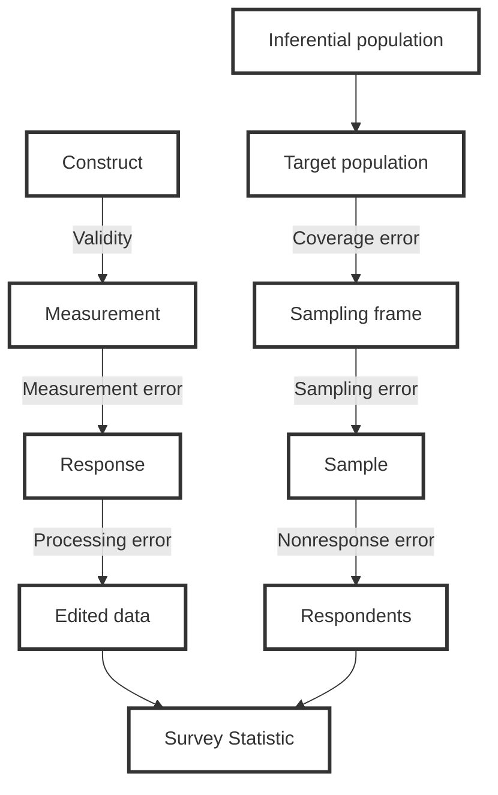

# Total survey error diagram

This is the "classic " total survey error diagram as given in [Groves and Lyberg (2010)]( https://doi.org/10.1093/poq/nfq065).



If you are concerned with other sources of error, you can just add more arrows to this diagram at your pleasure!

```mermaid
graph TB
%% representation branch
  subgraph Representation
    Inference[Inferential population] --> Target[Target population]
    Target -->|Coverage error| Frame[Sampling frame]
    Frame -->|Sampling error| Sample
    Sample -->|Nonresponse error| Respondents
  end
  Respondents --> Analysis
%% extras
  Mode((Survey Mode)) --> Frame
  Mode --> Response
  Analysis((Analytic error)) --> Stat[Survey Statistic]
%% measurement branch
  subgraph Measurement
    Construct -->|Validity| Measurement 
    Measurement -->|Measurement error| Response
    Response -->|Processing error| Edited[Edited data]
  end
  Edited --> Analysis
%% extras
  Response -->|Screening| Frame
%% styles
  style Construct fill:#fff,stroke:#333,stroke-width:3px
  style Measurement fill:#fff,stroke:#333,stroke-width:3px
  style Response fill:#fff,stroke:#333,stroke-width:3px  
  style Edited fill:#fff,stroke:#333,stroke-width:3px  
  style Stat fill:#fff,stroke:#333,stroke-width:3px  
  style Inference fill:#fff,stroke:#333,stroke-width:3px  
  style Target fill:#fff,stroke:#333,stroke-width:3px  
  style Frame fill:#fff,stroke:#333,stroke-width:3px  
  style Sample fill:#fff,stroke:#333,stroke-width:3px  
  style Respondents fill:#fff,stroke:#333,stroke-width:3px  
```

Thank you and enjoy.

This diagram is available at https://github.com/skolenik/TSE_diagram

Stas Kolenikov

